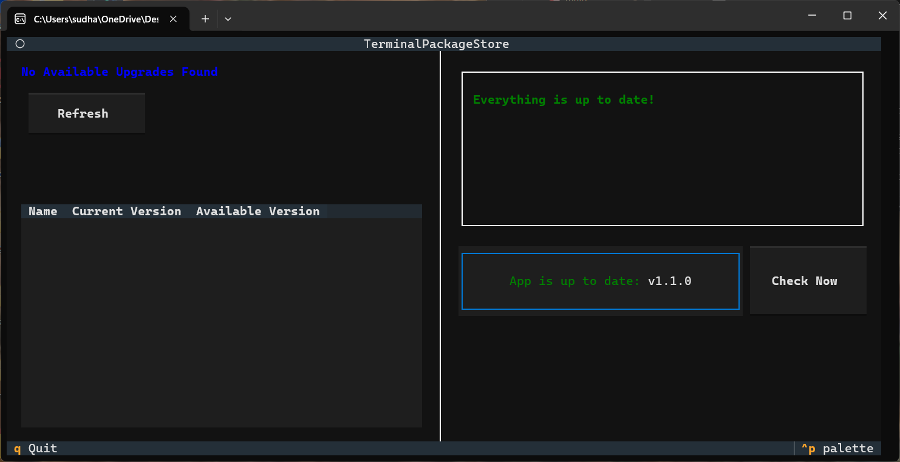

# Terminal Package Store

A **Terminal User Interface (TUI)** frontend for the **Windows Package Manager (winget)**.

Terminal Package Store provides a clean, fast, App-Store-like experience directly in your terminal, allowing you to browse, update, install, and uninstall applications — all powered by the official winget backend.



---

## 🚀 Features

- **App Store-like Layout** — A modern split-panel interface for browsing installed apps and updates.  
- **Smooth TUI Experience** — Powered by the **Textual** framework for responsive, interactive UI.  
- **Native Winget Integration** — Uses your existing system winget installation.  
- **Non-blocking Installs** — External install windows ensure the UI never freezes.  
- **Auto Version Checker** — Checks GitHub releases and notifies when updates are available.  
- **Clean, Lightweight, and Fast** — Works without admin rights (unless winget requires it).  

---

## 📦 Installation

### Prerequisites

Ensure you have:

- **Python 3.10+**  
- **Windows Package Manager (winget)**  
- **Windows 10/11**

---

### 🧪 Option 1: Run from Source (Development)

- Clone the repository:
  ```powershell
  git clone https://github.com/Sudhanshu-Ambastha/Terminal-Package-Store.git
  ```
  ```
  cd Terminal-Package-Store
  ```
- install dependency
  ```powershell
  pip install textual httpx
  ```
- Run app
  ```powershell
  python main.py
  ```

## Option 2: Standalone Executable (Recommended)

Download the pre-built **`.exe`** from the **Releases** section and run it directly — no installation required.

---

## 🛠️ Building the Executable (Developers)

If you want to build the `.exe` yourself, follow the steps below.

### 1. Install PyInstaller

```powershell
pip install pyinstaller httpx
```
### 2. Required Files

Ensure the following files exist in the **project root directory**:

- `main.py`
- `app_data_parser.py`
- `update_checker.py`
- `config_loader.py`
- `config.json`
- `package_store.css`
- `version_info.rc`
- `icon.ico`

---

### 3. Build Using PyInstaller

Run the following command to generate a **single-file executable**:

```powershell
pyinstaller main.py --onefile --name PackageStoreManager --hidden-import app_data_parser --hidden-import update_checker --hidden-import config_loader --hidden-import httpx --add-data "package_store.css:." --add-data "config.json:." --add-data "./app_data_parser.py:." --add-data "./update_checker.py:." --add-data "./config_loader.py:." --version-file version_info.rc --icon icon.ico
```
After building, the executable will appear in:
```
dist/PackageStoreManager.exe
```
---

## 🔏 Code Signing (Optional but Recommended)

Windows SmartScreen may block unsigned executables. Code signing helps prevent warnings.

### Generate a Self-Signed Certificate

```powershell
New-SelfSignedCertificate -Type CodeSigningCert -Subject "CN=Your Company Name" -CertStoreLocation Cert:\CurrentUser\My
```
### Sign the Executable

Replace `<CERTIFICATE_THUMBPRINT>` with your certificate’s **SHA1 thumbprint**:

```powershell
& "C:\Program Files (x86)\Windows Kits\10\bin\10.0.22621.0\x64\signtool.exe" sign `
    /sha1 <CERTIFICATE_THUMBPRINT> `
    /fd SHA256 `
    /tr http://timestamp.digicert.com `
    /td SHA256 `
    /v "PackageStoreManager.exe"
```
## 🤝 Contributing

Contributions are always welcome!

You can:
- Open an **issue**
- Submit a **pull request**
- Suggest **new features** or improvements

## 📜 License

[Apache License Version 2.0 © 2025 Sudhanshu Ambastha](./LICENSE)