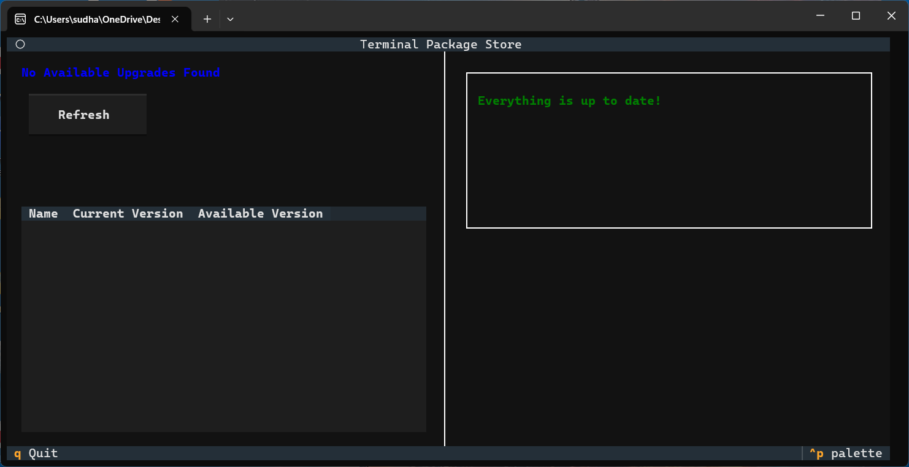

# Terminal Package Store

A **Terminal User Interface (TUI)** frontend for the **Windows Package Manager (winget)**.

Terminal Package Store provides a clean, fast, App-Store-like experience directly in your command line, allowing you to browse, upgrade, install, and uninstall applications — powered by the robust winget backend.



---

## 🚀 Features

- **App Store-like Experience** — Browse installed apps and available upgrades in a modern, divided panel layout.  
- **Real-time Interaction** — Built with the **Textual** framework for smooth, responsive UI.  
- **Direct Winget Integration** — Uses the system’s winget installation for reliable package management.  
- **Zero-Downtime Installs** — External install windows prevent the TUI from freezing during operations.

---

## 📦 Installation

### Prerequisites

Make sure you have the following installed:

- **Python 3.10+**  
- **Windows Package Manager (winget)**  

---

## Option 1: Run from Source (Development)

- Clone the repository
  ```powershell
  git clone https://github.com/Sudhanshu-Ambastha/Terminal-Package-Store.git
  ```
  ```
  cd Terminal-Package-Store
  ```
- install dependency
  ```powershell
  pip install textual
  ```
- Run app
  ```powershell
  python main.py
  ```

## Option 2: Standalone Executable (Recommended)

Download the pre-built **`.exe`** from the **Releases** section and run it directly — no installation required.

---

## 🛠️ Building the Executable (Developers)

If you want to build the `.exe` yourself, follow the steps below.

### 1. Install PyInstaller

```powershell
pip install pyinstaller
```
### 2. Required Files

Ensure the following files exist in the **project root directory**:

- `main.py`
- `app_data_parser.py`
- `package_store.css`
- `version_info.rc`
- `icon.ico`

---

### 3. Build Using PyInstaller

Run the following command to generate a **single-file executable**:

```powershell
pyinstaller main.py `
    --onefile `
    --name "PackageStoreManager" `
    --hidden-import "app_data_parser" `
    --add-data "package_store.css;." `
    --version-file "version_info.rc" `
    --icon "icon.ico"
```
Once completed, the final executable will be located inside the **dist/** folder.

---

## 🔏 Code Signing (Optional but Recommended)

Windows SmartScreen may block unsigned executables. Code signing helps prevent warnings.

### Generate a Self-Signed Certificate

```powershell
New-SelfSignedCertificate -Type CodeSigningCert -Subject "CN=Your Company Name" -CertStoreLocation Cert:\CurrentUser\My
```
### Sign the Executable

Replace `<CERTIFICATE_THUMBPRINT>` with your certificate’s **SHA1 thumbprint**:

```powershell
& "C:\Program Files (x86)\Windows Kits\10\bin\10.0.22621.0\x64\signtool.exe" sign `
    /sha1 <CERTIFICATE_THUMBPRINT> `
    /fd SHA256 `
    /tr http://timestamp.digicert.com `
    /td SHA256 `
    /v "PackageStoreManager.exe"
```
## 🤝 Contributing

Contributions are always welcome!

You can:
- Open an **issue**
- Submit a **pull request**
- Suggest **new features** or improvements
